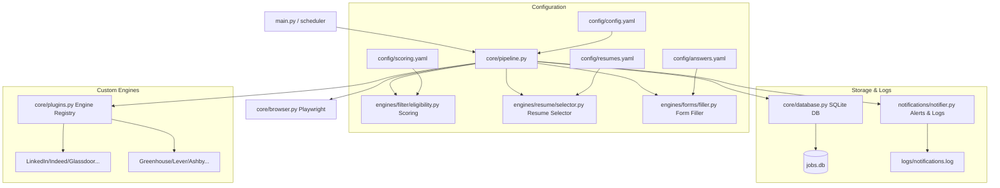

# AI Job Agent 🚀

AI Job Agent is a premium, automated end-to-end job search and application pipeline. It discovers job postings across multiple global platforms (LinkedIn, Indeed, Glassdoor, Naukri, Wellfound, Instahyre, etc.) and applicant tracking systems (Greenhouse, Lever, Ashby, Workable), filters and scores them based on custom candidate eligibility rules, matches the best resume template, and automates form-filling and submission using persistent browser profiles.

---

## 🔍 Table of Contents
1. [Key Features](#-key-features)
2. [Tech Stack](#%EF%B8%8F-tech-stack)
3. [Architecture & Component Layout](#-architecture--component-layout)
4. [Process Flow](#-process-flow)
5. [Configuration & Setup](#%EF%B8%8F-configuration--setup)
6. [Execution Modes](#-execution-modes)
7. [Operational Safety & Anti-Detection](#%EF%B8%8F-operational-safety--anti-detection)
8. [Testing & Verification](#-testing--verification)

---

## 🌟 Key Features

* **Multi-Platform Search & Parsing**: Seamlessly integrates with LinkedIn Easy Apply, traditional platforms (Indeed, Naukri, Glassdoor, Hirist, Foundit, Cutshort, Wellfound, Instahyre), and direct ATS job boards (Greenhouse, Lever, Ashby, Workable).
* **Smart Scoring & Filtering**: Multi-criteria matching engine evaluates roles by title, salary, location, description, and keywords using custom scoring weights.
* **Resume Auto-Selection**: Evaluates job descriptions to automatically select the most aligned resume template (e.g., General, Backend, AI/ML, Frontend).
* **Automated Form Filling & Q&A**: Detects input elements dynamically, automatically handles document uploads, and resolves custom application questions.
* **Human-Like Pacing & Anti-Detection**: Implements random timing delays, randomized scheduler jitters, human mouse/scrolling patterns, and persists browser sessions (cookies, logins) across runs.
* **Interactive Control Dashboard**: A text-based `rich` console terminal dashboard for run statistics, manual resume selection reviews, retry queues, and learned company profiles.
* **Real-time Notifications**: Instant Telegram message notifications containing application statuses, match scores, error details, and post-submission confirmation screenshots.

---

## 🛠️ Tech Stack

* **Core Runtime**: Python 3.10+
* **Automation & Scraping**: Playwright (Headless/Headful browser control, local cookie/session isolation)
* **ORM & Database**: SQLAlchemy with SQLite (`jobs.db`)
* **Logging & Alerting**: Loguru (file rotation, colorized logging), Telegram API, SMTP (Email Alerts)
* **Scheduling**: APScheduler (Interval triggers with custom randomized jitter)
* **Styling & CLI UI**: Rich console widgets (Table, Panel, Prompt, Progress)
* **Testing**: Pytest

---

## 📐 Architecture & Component Layout



### Main Directories & Components
* [main.py](file:///d:/Nivritha/Projects/Automation/project/main.py): Pipeline entry point parsing CLI flags and starting the automated runs or Telegram verification modes.
* [core/](file:///d:/Nivritha/Projects/Automation/project/core): Core infrastructure logic.
  * [pipeline.py](file:///d:/Nivritha/Projects/Automation/project/core/pipeline.py): The main coordinator that drives job scanning, login checks, limits checks, and submission loops.
  * [browser.py](file:///d:/Nivritha/Projects/Automation/project/core/browser.py): Controls headful/headless Chrome profiles, setting custom viewport parameters and caching user data.
  * [models.py](file:///d:/Nivritha/Projects/Automation/project/core/models.py): Defines data schemas (Pydantic models) and database entities (`DBJob`, `DBCompany`, `DBApplication`, `DBRun`, etc.).
  * [database.py](file:///d:/Nivritha/Projects/Automation/project/core/database.py): Houses standard SQLAlchemy engines, session makers, and initialization logic.
* [engines/](file:///d:/Nivritha/Projects/Automation/project/engines): Platform-specific crawlers, parser modules, and auto-apply mechanics.
  * `linkedin`, `greenhouse`, `lever`, etc.: Platform search/apply drivers.
  * [forms/](file:///d:/Nivritha/Projects/Automation/project/engines/forms): Houses the selector matching, file inputs, custom inputs, and React Select dropdown filling logic.
* [notifications/](file:///d:/Nivritha/Projects/Automation/project/notifications): Standardized messaging infrastructure formatters and handlers to deliver updates to Telegram or Email.
* [dashboard/](file:///d:/Nivritha/Projects/Automation/project/dashboard): Contains `terminal.py`, the CLI dashboard.

---

## 🔄 Process Flow

```
   [1. Scan & Discover] ──> [2. Eligibility Scoring] ──> [3. Resume Selection]
                                                                  │
                                                                  ▼
   [6. Telegram Notifications] <── [5. Apply Engine] <── [4. Forms Detection & Fill]
```

1. **Scan & Discover**: The script reads the target platform list and search keywords. Playwright navigates the respective boards, extracts job listings, and checks for duplication in the database.
2. **Eligibility Scoring**: Compares the discovered job against criteria specified in `config/scoring.yaml`. Checks titles against `skip_keywords`, calculates matching keyword densities, and decides whether the candidate fits.
3. **Resume Selection**: Inspects the job content and cross-references it with configurations inside `config/resumes.yaml` to choose the optimal resume.
4. **Forms Detection & Fill**: Maps form input tags (textareas, selectors, files, radio options) dynamically, maps standard profile fields (Name, Email, Social links) and fills them.
5. **Apply Engine**: Handles the dry-run, live submit, or stalls the application in a `pending_review` state if user intervention is required.
6. **Telegram Notifications**: Formats markdown details and dispatches them instantly to the designated chat, along with full screenshots of the final confirmation or captcha/error states.

---

## ⚙️ Configuration & Setup

All configuration templates are located in the [config/](file:///d:/Nivritha/Projects/Automation/project/config) folder:

* **[config.yaml](file:///d:/Nivritha/Projects/Automation/project/config/config.yaml)**: Controls scheduling interval, random limits (daily/hourly bounds), platform company listings, browser dimensions, and email settings.
* **[answers.yaml](file:///d:/Nivritha/Projects/Automation/project/config/answers.yaml)**: Contains standard personal details (name, email, phone, location, salary expectations, standard URLs) and exact key-value pairs matching custom form questions.
* **[resumes.yaml](file:///d:/Nivritha/Projects/Automation/project/config/resumes.yaml)**: Configures the paths to your local resume PDF templates and the keyword alignments required to trigger their selection.
* **[scoring.yaml](file:///d:/Nivritha/Projects/Automation/project/config/scoring.yaml)**: Dictates threshold scoring limits, description multipliers, and required skillset matches.

### Environment variables (`.env`)
Create a `.env` file in the root directory:
```env
TELEGRAM_BOT_TOKEN=your_telegram_bot_token
TELEGRAM_CHAT_ID=your_telegram_chat_id
```

---

## 💻 Execution Modes

### 1. Automated Mode (CLI)
To run a automated job agent cycle immediately:
```bash
# Run on all configured job boards
python main.py --site all --location "India"

# Run a dry run (form filling only, no final submit click)
python main.py --site linkedin --dry-run
```

Alternatively, you can execute the pre-configured Windows launcher scripts:
* **`run_automated.bat`**: Launches the automated search/apply pipeline for all sites with the location constraint configured to `"india"`.
* **`run_clean.bat`**: Resets the local `jobs.db` database to clear previous attempts/retries and initiates a fresh automated cycle.

### 2. Interactive Console Dashboard
Launches the control panel to view metrics, approve pending applications, check retry queues, or inspect learned profile models.
```bash
python dashboard/terminal.py
```

### 3. Quick Status Check
Get a terminal overview of real submissions, platform ratios, and recently processed listings.
```bash
python check_status.py
```

---

## 🛡️ Operational Safety & Anti-Detection

The agent utilizes multiple mitigation strategies to bypass bot detection:
1. **Rhythm Pacing**: Employs random delay ranges (e.g. `30s` to `180s`) before applying, mimicking human hesitation and reading behavior.
2. **Action Jitters**: Adds micro-delays between keystrokes (`press_sequentially`) and dropdown selections.
3. **Session Persistence**: Plays inside the `./browser_data` profile context, ensuring cookies and authentications persist, reducing the need for repetitive logins.
4. **Manual Login Prompting**: If a platform detects that a session has expired, it triggers a warning in Telegram and halts, allowing the user up to 120 seconds to complete authentication manually in the headful browser window before resuming.

---

## 🧪 Testing & Verification

To run components tests, run the following command in the root folder:
```bash
python -m pytest
```
Tests cover standard components validation (filtering, resume selector, form mapping, and message formatters).
